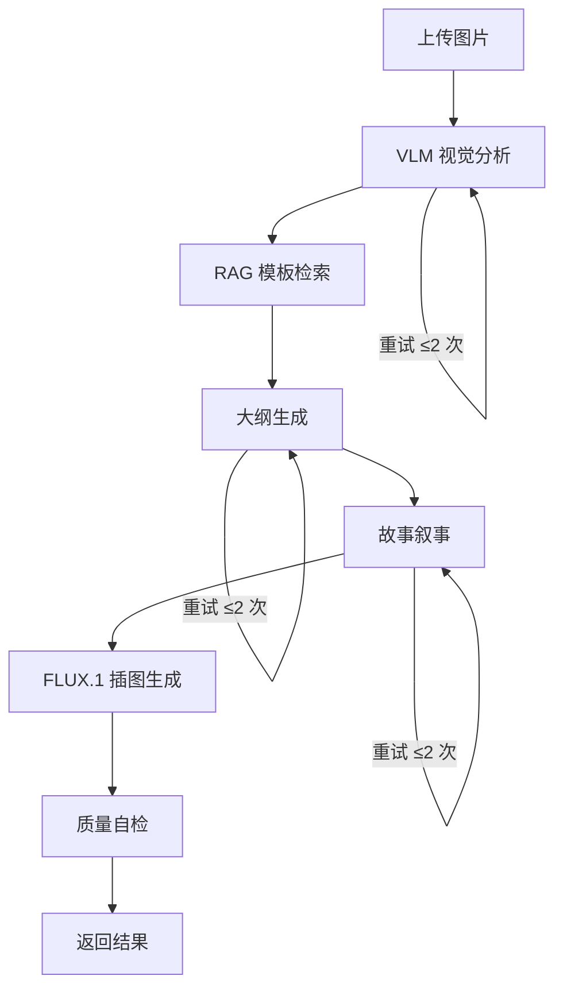

<p align="center">
  
</p>

<h1 align="center">📖 FableLens — 寓言透镜</h1>

<p align="center">
  <b>上传一张物品照片 → 自动生成寓言故事 + 连续绘本插图</b>
</p>

<p align="center">
  <a href="https://fablelens.vercel.app"></a>
</p>

<p align="center">
  
  
  
  
  
</p>

---

## 在线体验

**👉 [https://fablelens.vercel.app](https://fablelens.vercel.app)**

上传任意物品照片，选择风格，约 60 秒即可获得一篇完整的寓言故事和 4 张水彩绘本插图。

---

## 项目简介

FableLens 是一个 AI 驱动的寓言绘本生成器。你只需上传一张日常物品的照片（一把旧雨伞、一只陶瓷杯、一双旧鞋……），选择故事风格，系统就会自动完成：

1. **视觉理解** — VLM 分析物品外观，提取拟人化性格特征
2. **模板检索** — RAG 从 50 条寓言母本库中匹配最佳故事模板
3. **故事创作** — 大纲生成 → 完整叙事，500-800 字寓言故事
4. **绘本插图** — FLUX.1 生成 4 张风格一致的水彩绘本插图
5. **质量自检** — 自动检查拟人化、寓意、情绪弧线、插图完整性

整个流程由 **LangGraph** 编排，支持自动重试和 fallback。

---

## 技术架构

```
┌──────────────┐     ┌──────────────────────────────────────────────────┐
│   Next.js    │     │              FastAPI Backend                     │
│   Frontend   │────▶│                                                  │
│              │     │  ┌─────────── LangGraph Pipeline ──────────────┐ │
│  上传图片     │     │  │                                             │ │
│  选择风格     │     │  │  VLM ──▶ RAG ──▶ Outline ──▶ Narrative     │ │
│  绘本阅读     │     │  │   │              │              │           │ │
│              │     │  │   ▼              ▼              ▼           │ │
│              │◀────│  │ qwen-vl-max  ChromaDB      qwen-plus       │ │
│              │     │  │                                  │           │ │
│              │     │  │              Image Gen ◀─────────┘           │ │
│              │     │  │                 │                            │ │
│              │     │  │                 ▼                            │ │
│              │     │  │           FLUX.1-schnell                    │ │
│              │     │  │                 │                            │ │
│              │     │  │           Quality Check                     │ │
│              │     │  └─────────────────┴────────────────────────────┘ │
│              │     └──────────────────────────────────────────────────┘
└──────────────┘
```

### 技术栈

| 层级 | 技术 | 说明 |
|------|------|------|
| **前端** | Next.js 14 + Tailwind CSS | App Router, 绘本阅读模式, 拖拽上传 |
| **后端** | FastAPI + Uvicorn | 异步 API, 自动文档 |
| **编排** | LangGraph | 6 节点 DAG, 条件重试, 状态管理 |
| **VLM** | 通义千问 qwen-vl-max | 阿里云百炼 OpenAI 兼容接口 |
| **文本** | 通义千问 qwen-plus | 大纲生成 + 故事叙事 |
| **Embedding** | DashScope text-embedding-v3 | 1024 维向量 |
| **向量库** | ChromaDB | 本地持久化, 50 条寓言模板 |
| **图像** | FLUX.1-schnell | 硅基流动 SiliconFlow API |
| **评测** | 自研 4 维度评测体系 | 视觉/故事/插图/性能 |

---

## 项目结构

```
fablelens/
├── backend/
│   ├── app/
│   │   ├── api/            # FastAPI 路由
│   │   │   └── routes.py
│   │   ├── chains/         # LangGraph 工作流
│   │   │   └── fablelens_graph.py
│   │   ├── eval/           # 评测体系
│   │   │   └── evaluator.py
│   │   ├── models/         # Pydantic 数据模型
│   │   │   └── schemas.py
│   │   ├── prompts/        # Prompt 模板
│   │   │   ├── vision_prompts.py
│   │   │   └── story_prompts.py
│   │   ├── rag/            # RAG 向量检索
│   │   │   └── fable_rag.py
│   │   ├── services/       # 业务服务
│   │   │   ├── vision_service.py
│   │   │   ├── story_service.py
│   │   │   └── image_service.py
│   │   ├── utils/
│   │   └── config.py       # 配置管理
│   ├── data/
│   │   └── templates/      # 50 条寓言模板
│   │       └── fable_templates.json
│   ├── main.py             # 后端入口
│   ├── requirements.txt
│   ├── .env.example
│   └── run_eval.py         # 评测脚本
├── frontend/
│   └── src/app/
│       ├── page.tsx        # 主页面（含绘本模式）
│       ├── layout.tsx
│       └── globals.css
├── docs/
│   ├── eval_report.xlsx    # 评测报告
│   └── pipeline_graph.md   # LangGraph 流程图
└── .gitignore
```

---

## 快速开始

### 1. 克隆仓库

```bash
git clone https://github.com/XTB-888/-.git
cd -
```

### 2. 获取 API Key

| 服务 | 用途 | 获取地址 |
|------|------|----------|
| 阿里云百炼 | VLM + 文本生成 + Embedding | https://bailian.console.aliyun.com/ |
| 硅基流动 | FLUX.1 图像生成 | https://cloud.siliconflow.cn/ |

### 3. 配置环境变量

```bash
cd backend
cp .env.example .env
# 编辑 .env，填入你的 API Key
```

```env
DASHSCOPE_API_KEY=sk-your-key-here
SILICONFLOW_API_KEY=sk-your-key-here
```

### 4. 启动后端

```bash
cd backend
python -m venv .venv
.venv\Scripts\activate        # Windows
# source .venv/bin/activate   # macOS/Linux

pip install -r requirements.txt -i https://pypi.tuna.tsinghua.edu.cn/simple
python -m uvicorn main:app --host 0.0.0.0 --port 8000 --reload
```

### 5. 启动前端

```bash
cd frontend
npm install
npm run dev
```

### 6. 访问

- **在线体验**: https://fablelens.vercel.app
- **本地前端**: http://localhost:3000
- **API 文档**: http://localhost:8000/docs
- **健康检查**: http://localhost:8000/health

---

## LangGraph Pipeline



6 个节点，3 个带条件重试，端到端约 60s 完成。

---

## 评测结果

综合评级：**A (优秀) — 88.3 分**

| 维度 | 得分 | 权重 | 说明 |
|------|------|------|------|
| 视觉分析 | **100** / 100 | 15% | 物品识别、特征提取、拟人化性格 |
| 故事质量 | **100** / 100 | 40% | 标题、长度、分页、拟人化、寓意、情绪弧线 |
| 插图生成 | **91.7** / 100 | 20% | 4 张水彩风格绘本插图 |
| 性能 | **60** / 100 | 25% | 平均 71s（含 API 网络延迟） |

### 按风格分析

| 风格 | 总分 | 耗时 | 故事分 | 插图 |
|------|------|------|--------|------|
| 🌿 治愈 | 90.0 | 60s | 100 | 4/4 |
| ⚔️ 冒险 | 90.0 | 65s | 100 | 4/4 |
| 🌑 暗黑 | 85.0 | 88s | 100 | 3/4 |

运行评测：
```bash
cd backend
python run_eval.py           # 3 种风格各 1 次
python run_eval.py --runs 3  # 3 种风格各 3 次
```

---

## API 接口

| 方法 | 路径 | 说明 |
|------|------|------|
| `GET` | `/health` | 健康检查 |
| `POST` | `/api/generate` | 上传图片 + 风格 → 生成故事 |
| `GET` | `/api/task/{id}` | 查询任务状态 |
| `GET` | `/api/eval-results` | 获取评测结果 |

### 生成请求示例

```bash
curl -X POST http://localhost:8000/api/generate \
  -F "file=@photo.jpg" \
  -F "style=治愈"
```

---

## 前端功能

- **拖拽上传** — 支持点击和拖拽上传图片
- **三种风格** — 治愈 / 冒险 / 暗黑
- **实时进度** — 6 步 Pipeline 进度条
- **故事展示** — 分页阅读，场景/情绪标签
- **绘本模式** — 全屏沉浸式阅读，键盘翻页
- **响应式** — 适配桌面和移动端

---

## 开发日志

| Day | 内容 | 产物 |
|-----|------|------|
| 1-2 | 脚手架 + Schema + VLM | FastAPI + Next.js + qwen-vl-max |
| 3 | RAG 模板库 | 50 条寓言模板 + ChromaDB |
| 4 | 故事生成链 | OutlineChain + NarrativeChain |
| 5-6 | 图像生成 | FLUX.1-schnell × 4 张 |
| 7-8 | LangGraph | 6 节点 DAG + 重试 + 质量自检 |
| 9-10 | 前端优化 | 绘本模式 + 拖拽 + 进度条 |
| 11-12 | 评测优化 | 4 维度评测 + Prompt v2 + 限流重试 |
| 13-14 | 部署上线 | [Vercel](https://fablelens.vercel.app) + [Railway](https://fablens-production.up.railway.app/health) |

---

## 部署架构

| 服务 | 平台 | 地址 |
|------|------|------|
| **前端** | Vercel | https://fablelens.vercel.app |
| **后端 API** | Railway | https://fablens-production.up.railway.app |
| **源码** | GitHub | https://github.com/XTB-888/- |

---

## License

MIT
