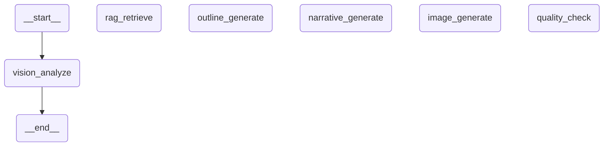

# FableLens Pipeline Graph

```mermaid
---
config:
  flowchart:
    curve: linear
---
graph TD;
	__start__(<p>__start__</p>)
	vision_analyze(vision_analyze)
	rag_retrieve(rag_retrieve)
	outline_generate(outline_generate)
	narrative_generate(narrative_generate)
	image_generate(image_generate)
	quality_check(quality_check)
	__end__(<p>__end__</p>)
	__start__ --> vision_analyze;
	vision_analyze --> __end__;
	classDef default fill:#f2f0ff,line-height:1.2
	classDef first fill-opacity:0
	classDef last fill:#bfb6fc

```
